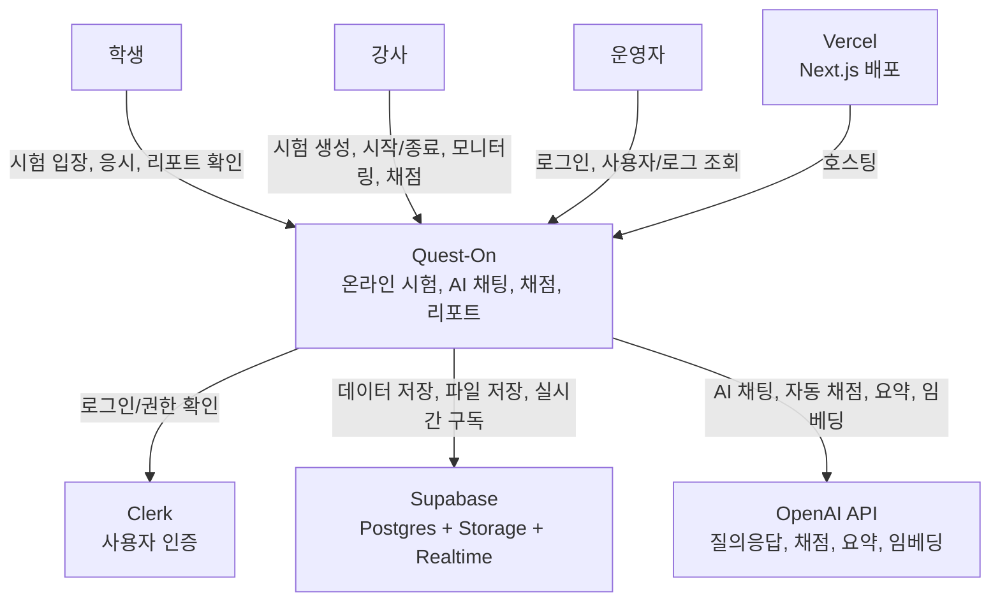
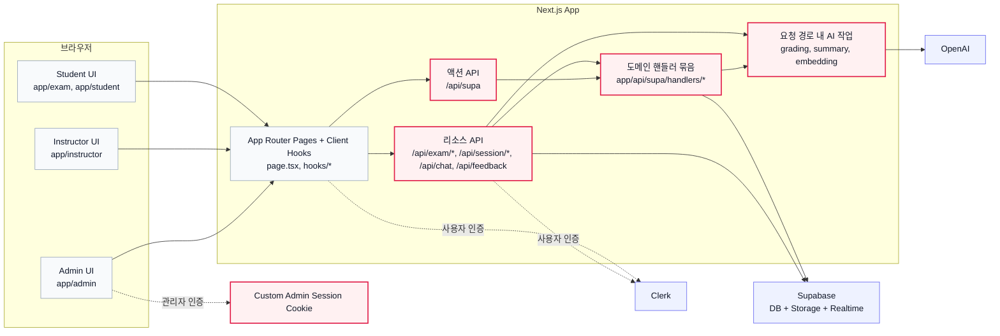
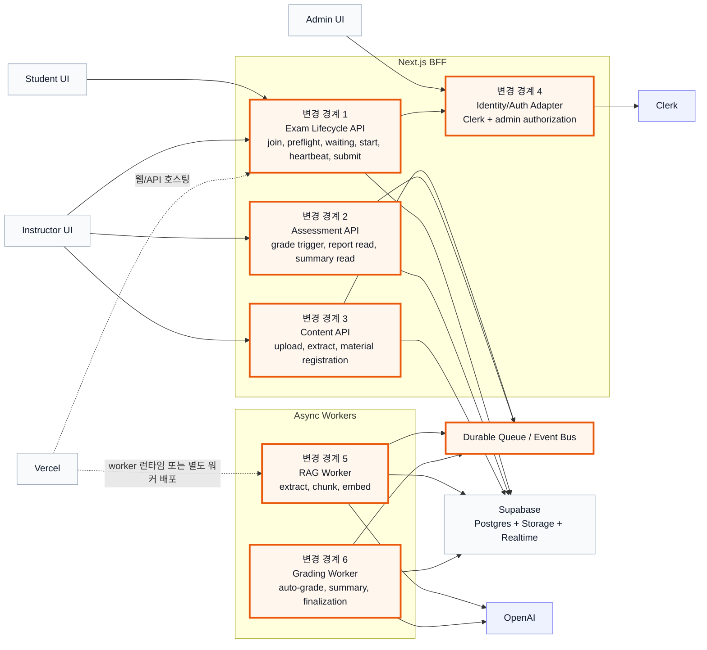

# Quest-On 설계 리뷰 초안

기준 시점: 2026-03-06

이 문서는 현재 코드베이스를 바탕으로 작성한 내부 검토용 초안이다. 제품 목적은 README와 주요 페이지/라우트 구조를 기준으로 정리했고, 가장 큰 pain point는 현재 구현상의 경계와 상태 전이 분산에서 추론했다.

## 1. 한 장짜리 개요

### 제품 목적

- 강사: 시험 생성, 시험 시작/종료, 학생 진행 모니터링, 채점/리포트 확인
- 학생: 시험 코드로 입장, 대기실/시험 응시, AI 채팅 활용, 제출 후 리포트 확인
- 운영: 관리자 페이지에서 로그/유저 관리

### 현재 가장 큰 pain point

- 시험 세션 상태머신이 클라이언트 훅, 페이지, `/api/supa` 액션 라우터, 리소스 라우트, Supabase 업데이트 로직에 분산되어 있다.
- 같은 도메인 규칙이 `init_exam_session`, `preflight`, `check_exam_gate_status`, `session_heartbeat`, `exam/start`, `feedback` 등 여러 경로에서 반복된다.
- 채점, 요약 생성, RAG 임베딩 생성 같은 무거운 작업이 요청 처리 경로 안에서 수행되어 지연과 실패 전파 범위가 넓다.

### 바꾸려는 이유

- 시험 입장, 대기실, 시작, 진행, 자동 제출, 채점까지 이어지는 핵심 플로우를 한 곳에서 통제해야 변경 비용이 줄어든다.
- `/api/supa` 액션 스위치와 리소스 기반 API가 공존하는 현재 구조는 진입점이 많아 영향 분석이 어렵다.
- 장기적으로는 비동기 작업, 장애 격리, 운영 가시성, API 계약 안정성이 필요하다.

## 2. As-Is Context



## 3. As-Is Container



## 4. 문제가 발생하는 핵심 유저 플로우

현재 가장 민감한 플로우는 "학생이 시험에 입장해서 대기실을 거쳐 시험을 시작하고, 진행 중 heartbeat를 보내다가 제출과 채점을 완료하는 흐름"이다.

```mermaid
sequenceDiagram
  actor Student as 학생
  actor Instructor as 강사
  participant ExamPage as ExamPage + hooks
  participant SupaApi as /api/supa
  participant Preflight as /api/session/:id/preflight
  participant StartApi as /api/exam/:id/start
  participant FeedbackApi as /api/feedback
  participant SessionSvc as session-handlers
  database SB as Supabase
  participant AI as OpenAI

  Student->>ExamPage: 시험 코드로 진입
  ExamPage->>SupaApi: init_exam_session
  SupaApi->>SessionSvc: 상태 계산, 세션 생성/복원
  SessionSvc->>SB: exams + sessions + submissions + messages 조회
  SessionSvc-->>ExamPage: sessionStatus, timeRemaining, messages 반환

  alt preflight 필요
    Student->>Preflight: 시험 유의사항 수락
    Preflight->>SessionSvc: waiting 또는 in_progress로 전환
    SessionSvc->>SB: session.status, preflight_accepted_at 업데이트
    Preflight-->>ExamPage: 갱신된 gate 상태 반환
  end

  loop 시험 시작 전
    ExamPage->>SupaApi: check_exam_gate_status
    SupaApi->>SessionSvc: 시험 시작 여부 재계산
    SessionSvc->>SB: exams.started_at, sessions.status 조회
    SupaApi-->>ExamPage: waiting 또는 in_progress
  end

  Instructor->>StartApi: 시험 시작
  StartApi->>SB: exam running 전환 + waiting 세션 일괄 전환
  ExamPage->>SupaApi: session_heartbeat / save_draft 반복
  SupaApi->>SessionSvc: 남은 시간 계산, 자동 제출 여부 확인
  SessionSvc->>SB: last_heartbeat_at, submissions 업데이트

  Student->>FeedbackApi: 최종 제출
  FeedbackApi->>SB: session submitted 반영
  FeedbackApi->>AI: 자동 채점 실행
  AI-->>FeedbackApi: 채점 결과
  FeedbackApi->>SB: grades / summary 저장
  FeedbackApi-->>Student: 제출 완료

  Note over ExamPage,SB: 문제점: 상태 규칙이 클라이언트, 리소스 API, 액션 API, 핸들러에 중복되어 변경 영향이 넓다.
  Note over FeedbackApi,AI: 문제점: 채점과 요약이 요청 경로 안에 있어 지연과 실패가 사용자 요청에 직접 전파된다.
```

## 5. To-Be 구조

목표는 "시험 세션 오케스트레이션"과 "비동기 AI 작업"의 경계를 명확히 분리하는 것이다. 아래 다이어그램에서 강조된 노드가 바뀌는 경계다.



## 6. ADR 후보

### ADR-001. 시험 세션 상태머신의 소유 경계

- 상태: Proposed
- Context: `init_exam_session`, `preflight`, `check_exam_gate_status`, `session_heartbeat`, `exam/start`, `feedback`가 각자 세션 상태를 해석한다.
- Decision: 시험 세션 상태 전이는 `Exam Lifecycle API`와 그 하위 도메인 서비스만 변경할 수 있도록 제한한다.
- Consequence: 클라이언트 훅은 상태 계산 대신 표시와 이벤트 전달만 담당한다.

### ADR-002. API 표면 전략

- 상태: Proposed
- Context: `/api/supa` 액션 스위치와 리소스 라우트가 공존해 도메인 진입점이 분산되어 있다.
- Decision: 신규 기능은 리소스 또는 도메인 명시형 API로만 추가하고, `/api/supa`는 coexistence 기간 동안 읽기/레거시 쓰기 호환층으로 축소한다.
- Consequence: 계약이 명확해지고 테스트 범위와 추적 경로가 단순해진다.

### ADR-003. 데이터 모델 분리

- 상태: Proposed
- Context: 운영 데이터(exams, sessions, submissions, messages)와 파생 AI 데이터(ai_summary, grades, chunks)가 같은 요청 흐름에서 함께 갱신된다.
- Decision: 운영 트랜잭션 데이터와 파생/비동기 산출물을 논리적으로 분리한다. 핵심 제출 성공 조건은 "세션 제출 기록 완료"까지만 본다.
- Consequence: 채점/요약 실패가 제출 자체를 오염시키지 않고, 재처리와 재생성이 쉬워진다.

### ADR-004. 인증 및 권한 경계

- 상태: Proposed
- Context: 일반 사용자는 Clerk를 쓰지만 관리자는 커스텀 쿠키 기반 세션을 별도로 사용한다.
- Decision: 인증은 Clerk 중심으로 유지하되, BFF 내부에 `Identity/Auth Adapter`를 두어 일반 사용자 권한과 관리자 권한을 같은 정책 계층에서 해석한다.
- Consequence: 라우트별 권한 판정이 일관되어지고 감사 로그와 테스트 작성이 쉬워진다.

### ADR-005. 비동기 작업 및 배포 전략

- 상태: Proposed
- Context: 자동 채점, 요약 생성, 임베딩 생성이 API 요청 경로 안에서 실행된다. 현재 배포는 Vercel 중심이며 함수별 `maxDuration`에 의존한다.
- Decision: 요청 경로는 enqueue까지만 수행하고, 채점/RAG는 durable queue와 worker가 처리한다. 배포도 웹과 worker를 분리 가능한 형태로 본다.
- Consequence: 사용자 체감 지연을 줄이고, OpenAI 또는 외부 의존성 장애를 격리할 수 있다.

## 7. 이행 단계

### Phase 0. Discovery

- 세션 상태 전이 맵을 명시적으로 문서화한다.
- `/api/supa`와 리소스 API의 책임 중복을 목록화한다.
- 제출, 자동 제출, 채점, 요약, 임베딩에 trace id와 운영 메트릭을 붙인다.

### Phase 1. Coexistence

- `Exam Lifecycle API`, `Assessment API`, `Content API` 골격을 추가한다.
- 기존 `/api/supa`는 신규 경계를 호출하는 호환층으로 점진 전환한다.
- 채점/임베딩은 우선 enqueue 인터페이스를 만들고, 실제 처리 경로는 기존 구현을 감싼다.

### Phase 2. Migration

- 학생 시험 플로우를 신규 lifecycle 경계로 이동한다.
- 강사의 시험 시작/종료, 채점, 요약 읽기 경로를 신규 API로 이동한다.
- RAG 처리와 자동 채점을 worker 기반으로 전환하고, 읽기 모델을 안정화한다.

### Phase 3. Cleanup

- `/api/supa`의 도메인 액션을 제거하거나 읽기 전용 최소 셋으로 축소한다.
- 요청 경로 내 동기 채점/요약/임베딩 코드를 제거한다.
- 중복 상태 계산 로직과 레거시 인증 분기, 더 이상 쓰지 않는 상태 전이 코드를 정리한다.

## 근거로 본 주요 코드 위치

- `app/exam/[code]/page.tsx`
- `hooks/useExamSession.ts`
- `components/exam/WaitingRoom.tsx`
- `app/api/supa/route.ts`
- `app/api/supa/handlers/session-handlers.ts`
- `app/api/session/[sessionId]/preflight/route.ts`
- `app/api/exam/[examId]/start/route.ts`
- `app/api/feedback/route.ts`
- `app/api/instructor/generate-summary/route.ts`
- `app/api/supa/handlers/exam-handlers.ts`
